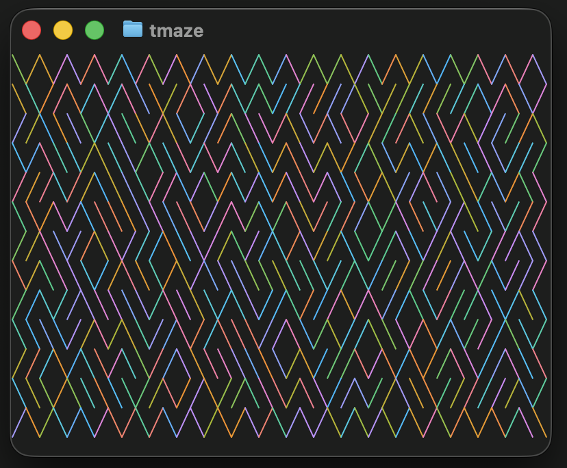
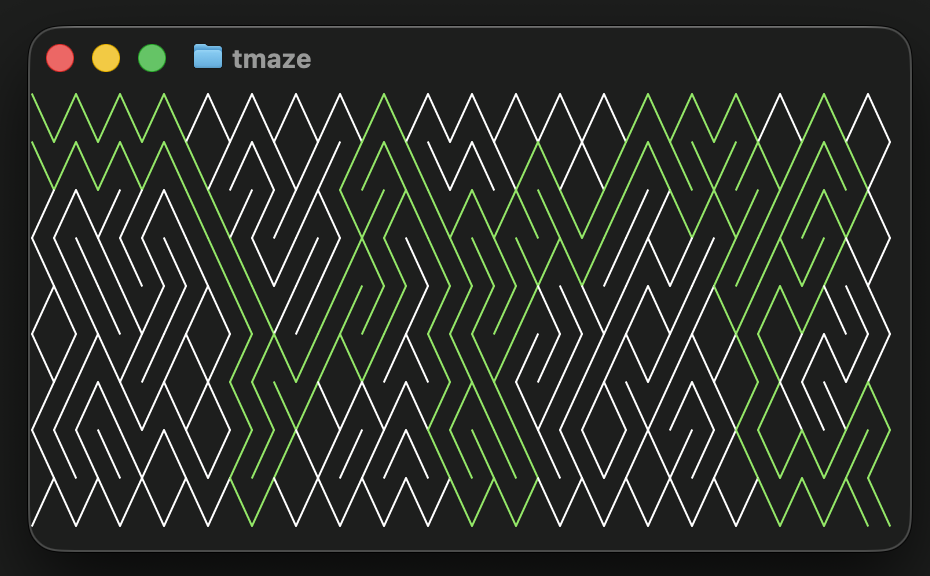

[](https://goreportcard.com/report/fortio.org/tmaze)
[](https://github.com/fortio/tmaze/releases/)
[](https://github.com/fortio/tmaze/actions/workflows/include.yml)
[](https://codecov.io/github/fortio/tmaze)

# tmaze

Ansi pixels version of the C64 classic maze

In mono:
```
╲╱╲╱╲╱╲╱╲╱╲╱╲╱╲╱╲╱╲╱╲╱╲╱╲╱╲╱╲╱╲╱╲╱╲╱╲╱╲╱╲╱╲╱╲╱╲╱╲╱╲╱╲╱╲╱╲╱╲╱╲╱╲╱╲╱╲╱╲╱╲╱╲╱╲╱╲╱╲╱
╲╱╲╲╲╲╱╲╲╱╱╲╱╱╲╲╲╱╱╱╱╲╲╱╲╱╲╱╱╱╲╲╱╱╲╱╲╲╱╲╲╲╲╲╱╱╲╲╲╱╲╱╲╱╲╱╲╱╱╱╲╱╱╲╱╱╲╲╲╲╲╲╱╲╱╱╲╲╱╲
╱╲╲╲╱╱╲╲╱╲╱╱╲╲╱╱╱╱╲╲╱╲╱╲╲╱╲╱╲╱╲╲╲╱╱╱╱╱╲╱╲╱╲╱╲╱╱╲╲╱╲╱╱╱╱╲╲╲╱╲╱╱╲╱╲╲╱╱╱╲╲╱╲╲╱╱╲╲╱╱
╲╱╲╲╲╱╱╲╱╲╲╱╲╲╲╱╲╲╱╲╲╱╱╲╲╱╱╲╱╲╱╱╲╲╱╲╲╲╲╱╱╱╲╱╲╱╱╱╱╲╲╲╱╱╱╱╱╲╲╲╲╲╱╱╲╱╲╲╱╲╲╲╲╱╲╲╱╲╲╲
╱╱╲╲╱╱╲╲╲╲╲╲╲╲╱╱╱╲╱╲╲╲╱╱╲╲╲╱╱╱╲╱╲╱╲╲╱╲╱╱╱╲╲╲╲╲╲╲╱╱╱╲╱╲╱╱╲╱╱╲╲╲╲╲╱╱╲╲╲╱╲╱╱╱╲╲╱╱╱╱
╲╱╲╲╱╲╲╱╲╲╲╱╱╲╱╲╱╱╱╲╲╱╲╲╱╲╲╲╱╲╱╲╱╲╲╱╱╱╱╱╱╲╱╱╲╱╲╱╲╲╱╲╲╱╲╱╲╱╲╲╱╱╲╲╱╱╱╱╲╲╱╲╱╲╲╲╱╲╱╲
╱╲╲╱╲╱╲╲╲╱╲╱╱╱╱╱╲╱╱╱╱╱╱╲╲╲╲╱╲╱╲╲╱╲╲╱╲╱╲╱╲╲╱╱╱╱╲╱╲╲╲╱╲╲╲╲╲╱╱╲╱╲╱╲╲╱╱╱╲╲╲╲╱╲╱╱╱╲╲╱
╲╱╲╲╱╲╲╲╲╱╱╲╱╲╲╱╱╱╱╱╱╱╱╲╱╱╲╱╲╱╲╲╱╱╱╱╱╲╲╲╲╲╱╲╱╲╲╱╱╲╲╲╲╲╲╱╲╲╲╱╲╱╲╲╱╱╱╲╱╲╱╱╱╱╲╲╱╲╲╲
╱╲╱╱╲╲╱╲╲╱╱╲╲╲╱╱╲╲╱╱╱╱╲╱╲╱╱╲╲╲╲╲╱╱╲╱╱╱╱╱╲╲╲╲╱╱╱╲╱╲╱╱╱╱╱╲╲╱╲╲╲╱╲╲╱╲╲╲╱╲╱╲╲╱╲╱╱╲╲╱
╲╱╱╱╲╲╱╲╱╱╱╱╲╲╲╲╲╱╱╱╲╲╱╲╲╲╱╲╲╱╲╲╱╲╲╱╱╲╲╱╱╲╲╲╱╲╲╱╱╲╲╲╲╱╱╱╲╱╱╱╲╲╲╲╱╱╲╲╲╲╲╱╱╱╲╱╱╲╲╲
╱╱╱╱╱╱╲╱╲╱╲╱╲╲╱╱╱╲╱╲╱╱╲╱╱╱╲╱╱╲╱╲╱╲╲╱╱╲╱╲╱╲╲╲╱╲╱╱╲╲╲╱╱╱╲╱╲╲╲╱╱╱╲╱╲╱╲╱╲╲╱╱╱╲╱╲╲╱╲╱
╲╱╱╱╱╱╱╱╲╱╲╱╱╱╲╱╱╱╲╱╲╱╱╲╲╲╱╲╲╲╱╱╲╲╱╲╲╲╲╲╲╲╱╲╱╱╲╲╱╲╲╲╱╱╱╱╲╲╱╱╱╲╲╲╱╱╲╲╱╲╲╲╱╲╲╲╱╲╲╲
╱╱╲╲╲╱╱╲╱╲╱╱╱╱╱╲╱╱╲╲╱╲╱╱╲╲╲╲╲╱╱╲╱╱╲╱╲╱╲╱╱╱╱╲╲╲╲╲╲╲╲╲╱╱╲╲╱╱╲╲╲╱╲╲╲╲╲╱╱╲╲╱╱╲╱╲╲╱╲╱
╲╲╱╱╲╲╱╲╱╱╲╲╲╲╱╱╱╱╱╱╱╱╱╲╲╱╱╲╱╲╲╱╱╱╱╲╲╲╲╲╱╲╱╱╲╱╱╱╲╱╲╲╲╲╲╲╲╲╱╲╱╱╱╲╱╱╲╲╱╲╱╲╱╱╱╲╲╲╲╲
╱╱╱╱╲╱╲╱╲╲╱╱╱╱╱╲╱╱╲╲╲╱╱╲╱╱╱╲╲╲╱╲╱╱╱╲╲╲╲╱╲╱╱╲╱╲╱╲╲╱╱╲╲╲╱╱╲╱╱╱╲╲╱╲╱╲╱╲╱╱╲╱╲╲╲╱╲╲╱╱
╲╲╲╱╲╱╱╲╱╲╱╱╲╱╲╲╲╲╱╲╱╱╲╱╱╱╱╲╱╲╲╲╱╲╲╲╲╲╲╱╱╱╲╲╲╱╱╱╲╲╲╱╲╱╱╱╲╲╲╲╲╲╲╲╲╲╱╱╱╱╱╲╱╱╲╲╲╲╱╲
╱╲╱╲╱╱╲╱╲╱╱╲╱╱╱╱╱╲╱╱╲╱╱╲╱╱╱╲╲╱╱╲╱╱╲╲╱╲╱╲╲╱╲╲╲╱╲╲╲╱╱╱╱╲╲╲╲╱╲╲╱╱╱╱╲╲╲╱╲╲╲╱╲╲╱╲╱╱╲╱
╲╱╲╲╲╱╲╱╱╱╱╱╱╱╲╱╱╱╲╱╱╲╱╲╱╲╱╱╲╱╱╲╱╲╲╱╱╲╲╲╱╲╱╲╲╱╲╲╱╲╲╲╲╱╲╲╱╱╱╲╲╲╱╲╲╲╲╲╲╲╱╲╱╱╲╲╱╲╱╲
╱╱╲╱╲╱╲╱╲╲╱╲╱╲╱╱╲╱╲╲╱╱╱╲╲╱╲╲╱╱╱╱╲╱╱╲╲╲╱╱╱╱╱╲╲╲╲╲╲╱╱╲╱╲╲╲╲╱╲╲╱╲╱╱╱╱╱╲╱╲╱╲╲╱╱╱╱╱╲╱
╲╲╲╱╱╱╲╲╲╲╱╱╱╱╲╱╱╱╱╲╲╱╲╲╱╱╲╲╲╱╲╲╲╲╱╲╱╱╲╲╱╲╱╱╱╱╱╲╱╱╱╲╱╲╲╲╱╲╲╱╱╱╲╱╱╱╱╲╲╲╲╲╱╱╲╲╲╱╱╲
╱╱╲╱╲╱╲╲╲╱╱╲╲╲╲╱╱╲╱╲╱╱╱╱╱╲╲╱╱╱╲╱╱╲╲╲╱╲╲╲╱╲╱╲╲╲╱╲╱╲╲╱╱╲╲╲╱╲╲╱╱╱╱╱╲╲╱╱╲╱╱╲╱╲╲╲╲╲╱╱
╲╱╲╲╱╱╲╲╱╲╱╱╲╲╲╱╱╱╲╱╱╱╲╱╲╲╱╱╲╲╲╱╱╱╱╲╲╱╲╱╱╱╲╲╱╲╲╱╲╲╱╲╲╱╱╱╲╲╱╲╱╲╲╲╱╲╲╲╲╱╲╲╱╲╱╲╱╱╱╲
╱╱╱╲╱╱╲╲╱╱╱╲╲╲╲╱╱╱╱╱╱╱╱╲╲╱╱╱╲╱╱╱╲╲╲╲╱╲╲╱╱╲╲╱╱╱╱╲╱╱╱╱╱╱╱╲╲╱╲╱╲╱╲╲╲╲╱╱╲╲╲╲╱╱╱╱╱╲╲╱
╲╲╱╱╲╲╲╲╲╱╱╱╱╱╱╲╲╱╱╱╱╲╲╲╱╲╲╲╱╲╲╲╲╱╱╲╱╱╱╲╱╲╲╱╲╲╱╱╲╱╲╱╱╱╲╱╱╱╱╱╱╲╱╲╱╲╱╱╲╱╲╱╱╱╱╲╱╱╲╲
╱╲╱╲╱╲╱╲╱╲╱╲╱╲╱╲╱╲╱╲╱╲╱╲╱╲╱╲╱╲╱╲╱╲╱╲╱╲╱╲╱╲╱╲╱╲╱╲╱╲╱╲╱╲╱╲╱╲╱╲╱╲╱╲╱╲╱╲╱╲╱╲╱╲╱╲╱╲╱╱
```

In color ('C' key to toggle):




Hit 'P' (path) or 'S' to solve the maze (solver animation speed is controlled by `-fps` flag):




## Install
You can get the binary from [releases](https://github.com/fortio/tmaze/releases)

Or just run
```
CGO_ENABLED=0 go install fortio.org/tmaze@latest  # to install (in ~/go/bin typically) or just
CGO_ENABLED=0 go run fortio.org/tmaze@latest  # to run without install
```

or
```
brew install fortio/tap/tmaze
```

or
```
docker run -ti fortio/tmaze
```


## Usage

```
tmaze help

flags:
  -fps float
        Frames per second (ansipixels rendering) (default 120)
  -height int
        Height of the maze (0 for full terminal height)
  -mono
        Use monochrome mode
  -nl
        Add newlines at end of each line (helps with copy/paste)
  -truecolor
        Use true color (24-bit RGB) instead of 8-bit ANSI colors (default is true if COLORTERM is set)
  -width int
        Width of the maze (0 for full terminal width)
```
